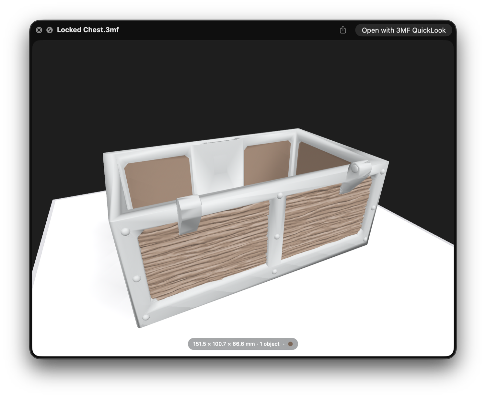
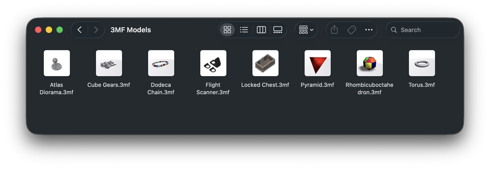
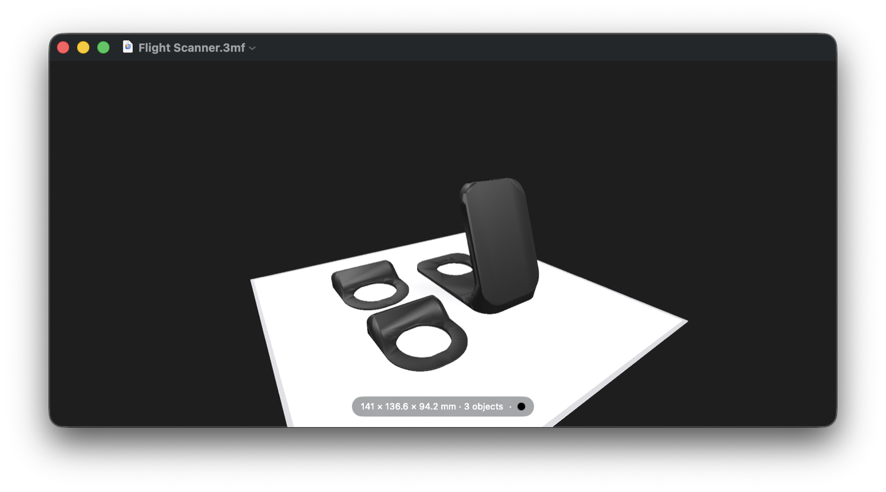

<p align="center">
  
</p>

# 3MF QuickLook

Quick Look previews and Finder thumbnails for `.3mf` files on macOS 15+.
Press Space on a 3MF file and get an interactive 3D preview; folders of models
get real thumbnails instead of blank icons.

<p align="center">
  
</p>

- **Preview** — Space on any `.3mf` file opens a real 3D view: drag to orbit,
  scroll or pinch to zoom, secondary-drag to pan. The preview appears
  instantly using the thumbnail stored inside the file, then crossfades to the
  interactive scene once it's built.
- **Thumbnails** — Finder icons and grid thumbnails are true offscreen renders
  of the model, with the file's own colors.

  

- **Slicer projects** — Bambu Studio and OrcaSlicer projects preview like the
  slicer: parts in their assigned filament colors, on a flat plate outline at
  the true plate size. Every build plate is browsable from the filmstrip.
  PrusaSlicer projects preview their geometry without filament colors or
  plates.
- **Sliced files** — `.gcode.3mf` files preview as the slicer's own plate
  images alongside their print metadata, rather than as 3D geometry.
- **Painted models** — multi-color painted models render in their paint
  colors, approximated per triangle.
- **Info line** — dimensions, object count, estimated print time, and a dot
  for each filament in use.
- **Built for real-world files** — oversized meshes, corrupt archives and zip
  bombs are detected and reported rather than hanging Finder. Models too
  detailed to preview inline say so, and open in the app instead.
- **Host app** — a thin viewer: open a `.3mf` file for the same interactive
  view in a window, with first-run onboarding for enabling the extensions.
  It's not a slicer or an editor.

  

## Install

1. Download the latest `3MFQuickLook-<version>.dmg` from
   [Releases](https://github.com/angusjune/3MFQuickLook/releases).
2. Open it and drag **3MF QuickLook** to Applications.
3. Launch the app once — that registers the Quick Look extensions with macOS.
   First launch offers onboarding that checks the extensions' status, links to
   the System Settings pane that enables them, and bundles a sample file to
   test with. The app registers only as an *alternate* `.3mf` handler — it
   never takes over your double-click default.

Builds are not notarized, so Gatekeeper blocks the first launch: double-click
the app once, then go to **System Settings → Privacy & Security**, scroll
down, and click **Open Anyway**. Alternatively, before first launch:
`xattr -d com.apple.quarantine "/Applications/3MF QuickLook.app"`. This is a
one-time step — later launches and automatic updates are unaffected. The app
keeps itself current via [Sparkle](https://sparkle-project.org) (check
manually with **3MF QuickLook → Check for Updates…**).

### If previews don't show up

macOS occasionally needs a nudge to route Quick Look to a new extension:

- Check the extensions are enabled: **System Settings → General → Login Items
  & Extensions → Extensions → Quick Look** — both *3MF QuickLook* entries
  should be on.
- Relaunch Finder (Option-right-click its Dock icon → Relaunch), or log out
  and back in.

## Usage

- Select a `.3mf` file in Finder and press **Space**: interactive preview
  (drag = orbit, scroll/pinch = zoom, secondary drag = pan).
- With a multi-plate slicer project, pick a plate from the filmstrip.
- Icon and gallery views show rendered thumbnails automatically.
- Double-click (or "Open With") to view the model in the app window. The app
  has no preview complexity limit, so very detailed models that can't render
  inline still open here.

## Building from source

Requires Xcode 26+ and [XcodeGen](https://github.com/yonaskolb/XcodeGen)
(`brew install xcodegen`). The Xcode project is generated, not committed:

```sh
xcodegen generate
xcodebuild -project ThreeMFQuickLook.xcodeproj -scheme ThreeMFQuickLook \
  -configuration Debug -derivedDataPath build build
open "build/Build/Products/Debug/3MF QuickLook.app"   # registers the extensions
qlmanage -r                                            # reset Quick Look after rebuilds
```

Then press Space on any `.3mf` file in Finder.

### Layout

- `App/`, `PreviewExt/`, `ThumbExt/` — the Host App and the two Quick Look
  extensions, thin adapters over the packages.
- `Packages/ThreeMFKit` — 3MF parsing: package file → `ThreeMFDocument`.
- `Packages/ThreeMFViewer` — scene building and the shared interactive Viewer:
  document → RealityKit entity tree, plus offscreen thumbnail rendering.
- `Packages/HostAppKit` — Host-App-side logic: Quick Look extension status
  probing, onboarding policy, the bundled sample.
- `SmokeTests/` — end-to-end thumbnail smoke test.
- `scripts/`, `packaging/`, `.github/workflows/` — the release pipeline
  ([docs/RELEASING.md](docs/RELEASING.md)). The app icon and DMG backdrop are
  drawn by `scripts/generate_art.swift`; the committed PNGs are its output.
- `appcast.xml` — the Sparkle update feed, appended by the release workflow.

### Tests

```sh
swift test --package-path Packages/ThreeMFKit
swift test --package-path Packages/ThreeMFViewer
swift test --package-path Packages/HostAppKit
xcodebuild -project ThreeMFQuickLook.xcodeproj -scheme ThreeMFQuickLook \
  -configuration Debug -derivedDataPath build test    # end-to-end smoke
```

The smoke test launches the built app to register the extensions, then requests
a thumbnail through the `QLThumbnailGenerator` API — the same path Finder uses.
Never probe thumbnails with `qlmanage -t`; it hangs against extension-based
providers.

### Releasing

Pushing a version tag (`v1.2.3`) builds the DMG, attaches it to a GitHub
Release and publishes the Sparkle appcast entry — see
[docs/RELEASING.md](docs/RELEASING.md) for the release checklist.

## License

MIT — see [LICENSE](LICENSE). Third-party notices are in
[THIRD-PARTY-LICENSES.md](THIRD-PARTY-LICENSES.md).
